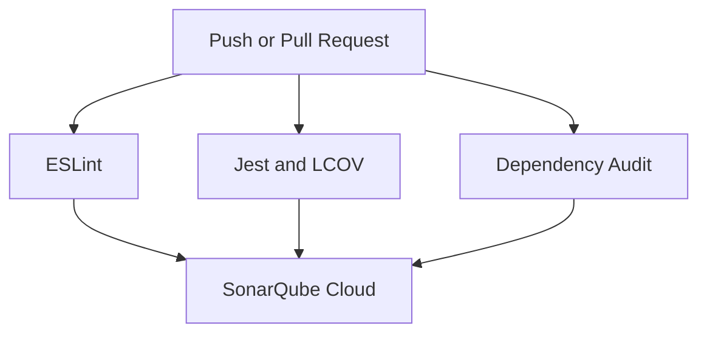

# Notes App Performance Testing

[](https://github.com/heruhdy/notes-app-performance-testing/actions/workflows/ci.yml)
[](https://sonarcloud.io/summary/overall?id=heruhdy_notes-app-performance-testing)
[](https://sonarcloud.io/summary/overall?id=heruhdy_notes-app-performance-testing)

## Overview

This project demonstrates an end-to-end DevOps quality and performance-testing workflow for a Node.js REST API. It combines automated code quality checks, unit testing, dependency auditing, SonarQube Cloud analysis, secure containerization, and k6 load testing.

The base Notes App was adapted from a DevOps bootcamp assignment and enhanced with production-oriented security, isolation, and CI practices.

## Technology Stack

| Area | Technology |
|---|---|
| Application | Node.js 22, Express 5 |
| Unit testing | Jest, Supertest |
| Code quality | ESLint |
| Security | npm audit, SonarQube Cloud |
| CI | GitHub Actions |
| Containerization | Docker, Docker Compose |
| Performance testing | Grafana k6 2.2.0 |
| Supported platform | Linux AMD64 and ARM64 |

## API Endpoints

| Method | Endpoint | Description |
|---|---|---|
| `GET` | `/` | Application health response |
| `GET` | `/notes` | List all notes |
| `GET` | `/notes/:id` | Retrieve one note |
| `POST` | `/notes` | Create a note |
| `PUT` | `/notes/:id` | Update a note |
| `DELETE` | `/notes/:id` | Delete a note |

## Project Components

| Path | Purpose |
|---|---|
| `.github/workflows/ci.yml` | GitHub Actions quality pipeline |
| `src/app.js` | Express application and API routes |
| `src/store.js` | In-memory note storage |
| `tests/` | Jest unit tests |
| `loadtest/script.js` | k6 smoke and load-test scenario |
| `Dockerfile` | Multi-stage production image |
| `compose.yaml` | Isolated and hardened application service |
| `sonar-project.properties` | SonarQube Cloud configuration |
| `.dockerignore` | Docker build-context exclusions |

## CI Quality Pipeline



The pipeline contains separate jobs for:

1. ESLint static analysis.
2. Jest unit tests and LCOV coverage generation.
3. Dependency auditing with a failure threshold of `low`.
4. SonarQube Cloud analysis after all prerequisite jobs succeed.

The LCOV report is transferred between jobs as a GitHub Actions artifact. No quality checks use bypasses such as `continue-on-error` or `|| true`.

## Verified Quality Results

Results verified on the `main` branch:

| Check | Result |
|---|---|
| ESLint | Passed with 0 errors |
| Jest | 5 tests passed |
| npm audit | 0 vulnerabilities |
| SonarQube Quality Gate | Passed |
| Security | A — 0 open issues |
| Reliability | A — 0 open issues |
| Maintainability | A — 0 open issues |
| SonarQube coverage | 74.1% |
| Duplications | 0.0% |

### Jest Coverage

| Metric | Coverage |
|---|---:|
| Statements | 80.3% |
| Branches | 41.66% |
| Functions | 77.77% |
| Lines | 87.93% |

SonarQube and Jest coverage values differ because SonarQube calculates overall coverage using covered lines and conditions.

## Container Security

The application container uses the following controls:

- Multi-stage Docker build.
- Production-only runtime dependencies.
- Non-root runtime user.
- Read-only root filesystem.
- Temporary writable `/tmp` filesystem.
- All Linux capabilities dropped.
- `no-new-privileges` enabled.
- Memory, CPU, and PID limits.
- Application port bound only to `127.0.0.1:3100`.
- Dedicated Docker bridge network.
- Express `X-Powered-By` header disabled to reduce fingerprinting.

## Running the Application

Docker and Docker Compose are the only host requirements.

```bash
git clone https://github.com/heruhdy/notes-app-performance-testing.git
cd notes-app-performance-testing

docker compose config --quiet
docker compose up -d --build --wait
docker compose ps
curl http://127.0.0.1:3100/
```

Stop and remove only the project resources:

```bash
docker compose down
```

## Running Quality Checks Locally

With Node.js 22 available:

```bash
npm ci
npm run lint
npm test -- --ci
npm audit --audit-level=low
```

The same checks run automatically through GitHub Actions for pull requests and pushes to `main`.

## Performance Testing

Start the application before running k6:

```bash
docker compose up -d --build --wait
```

### Smoke Test

```bash
docker run --rm \
  --network notes-perf-net \
  -e BASE_URL=http://notes-perf-app:3000 \
  -v "$PWD/loadtest/script.js:/scripts/script.js:ro" \
  grafana/k6:2.2.0 \
  run \
  --stage 5s:1 \
  --stage 5s:1 \
  --stage 5s:0 \
  /scripts/script.js
```

### Full Load Test

```bash
docker run --rm \
  --network notes-perf-net \
  -e BASE_URL=http://notes-perf-app:3000 \
  -v "$PWD/loadtest/script.js:/scripts/script.js:ro" \
  grafana/k6:2.2.0 \
  run /scripts/script.js
```

## Performance Results

| Metric | Smoke Test | Full Test |
|---|---:|---:|
| Duration | 15 seconds | 2 minutes |
| Maximum VUs | 1 | 50 |
| Iterations | 60 | 10,444 |
| HTTP requests/checks | 120 | 20,888 |
| Failed requests | 0.00% | 0.00% |
| Average response time | 2.20 ms | 25.28 ms |
| p95 response time | 4.64 ms | 112.44 ms |
| Maximum response time | 22.48 ms | 349.30 ms |
| Throughput | 7.94 req/s | 173.54 req/s |

Both performance thresholds passed:

- `http_req_duration`: p95 below 400 ms.
- `http_req_failed`: rate below 1%.

## Performance Finding

The full test received approximately 2.5 GB of response data. Each iteration creates a new note and then retrieves the complete, continuously growing collection. Although latency and error thresholds passed, this response-growth pattern can become a scalability concern for longer tests or larger datasets.

Potential improvements include adding pagination, limiting response size, resetting test data between scenarios, and using controlled fixtures for repeatable load tests.

## Security Improvement

SonarQube initially detected that Express exposed its framework identity through the default `X-Powered-By` response header. The application now disables that header:

```javascript
app.disable('x-powered-by');
```

After the change, SonarQube reported:

- Security rating A.
- 0 open security issues.
- Quality Gate passed.
- 100% coverage on the new code.

## Evidence

- [GitHub Actions workflow](https://github.com/heruhdy/notes-app-performance-testing/actions/workflows/ci.yml)
- [SonarQube Cloud analysis](https://sonarcloud.io/summary/overall?id=heruhdy_notes-app-performance-testing)

## Key Learnings

This project demonstrates how independent CI jobs provide clearer failure isolation while preventing SonarQube analysis from running when prerequisite quality checks fail. Pinpointing and correcting an invalid GitHub Action reference also highlighted the importance of validating third-party action versions.

Performance testing showed that acceptable latency does not automatically mean an API is scalable. Payload growth and total transferred data must also be reviewed alongside response time, throughput, and error rate.

## Purpose

Created as a hands-on DevOps engineering portfolio project covering CI, security analysis, container hardening, and performance testing.
